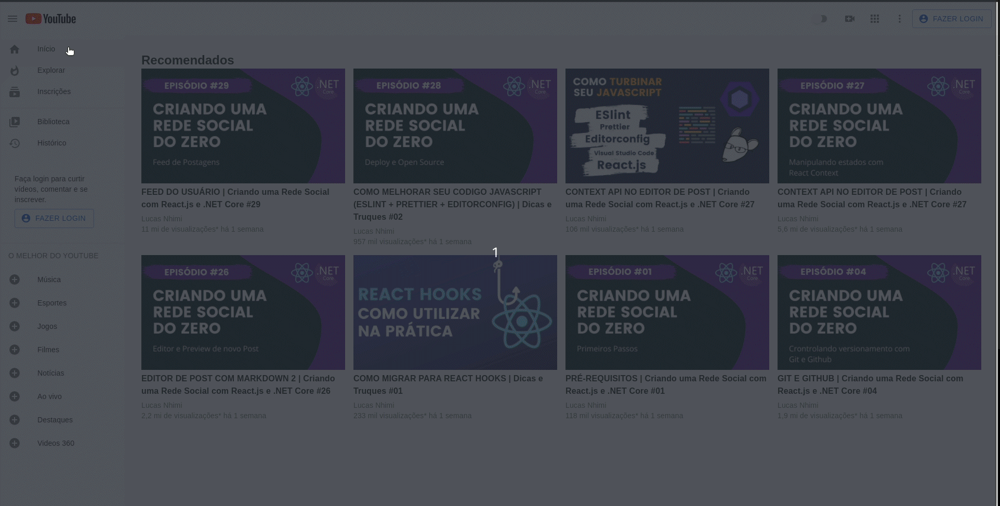

# Youtube Clone - React.JS + Material-UI 

## Projeto React.js tela inicial do YouTube com a biblioteca Material-UI.

 

  

 

### Foram utilizados os principais recursos da biblioteca Material-UI: 

 

Componentes Material Design;  
Customização de Temas;  
Estilização de componentes;  
Customização de componentes;  
Layout responsivo.  
